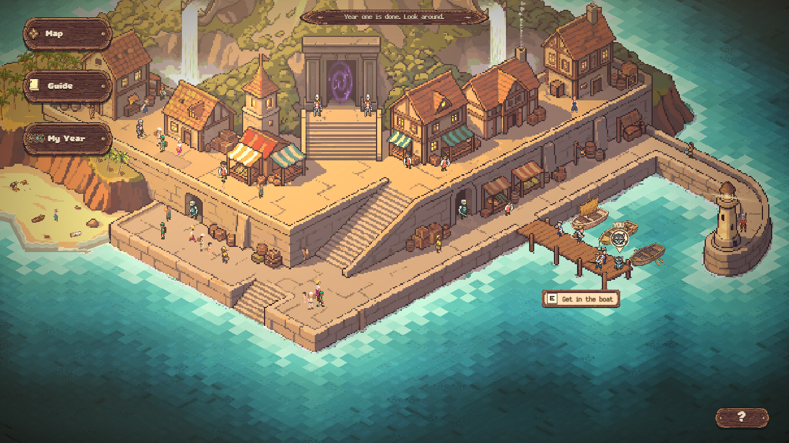

# BLHS Island Explorer

A game that shows Bonney Lake High School freshmen what the school has to offer: the clubs, the sports, the electives, the cords you can earn. You play as Thor, the school's panther, sail between islands, and every island is one real thing at the school. It runs in a browser on a school Chromebook with nothing to install.

Play it: https://blhs-island-explorer.vercel.app



## This repository

This is the engine. It draws the world, moves Thor, sails the ship, runs the school year, and runs the islands. The islands themselves are Python, written by club members in a separate repository, and the maps are painted in a separate tool.

| Repository | What it is |
| --- | --- |
| [BLHS-Vine](https://github.com/Algorithmic-Thinking-Club/BLHS-Vine) | the engine, this one |
| [BLHS-Island-Explorer](https://github.com/Algorithmic-Thinking-Club/BLHS-Island-Explorer) | the islands, in Python |
| [MAPVIS](https://github.com/ashwath-polali/MAPVIS) | the map tool the islands are painted in |

## Run it

```
npm install
npm run dev
```

Open http://localhost:5173. The first run copies the islands and the published maps in from the other two repositories, so clone the islands repository next to this one first.

`npm test` runs the tests. `npm run build` makes the deployable site.

## How an island gets in

A member paints a map in MAPVIS, names the spots on it, writes three Python files, and adds one line to `src/game/roster/member-islands.json`. The engine does the sailing, the arrival, the task list and the trophy wall. The islands repository has a skeleton to copy and a README that walks through it.


## Where things are

- `src/vine/` the Python vocabulary an island speaks, and the runtime it runs in
- `src/game/` the renderer and the scenes
- `src/app/` boot, the title screen, scene routing
- `api/` the small server side
- `scripts/` tooling and the browser proofs
- `public/grapes/` and `public/*-vendored/` copies of the islands and the maps, made at build time

Built by the Algorithmic Thinking Club at Bonney Lake High School.
